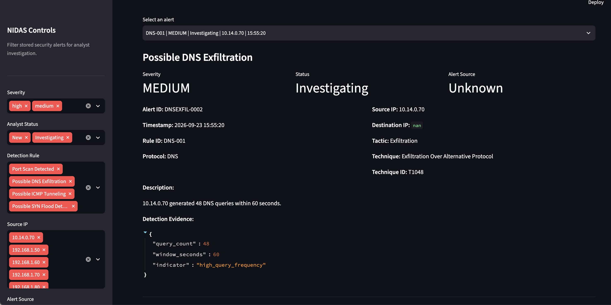
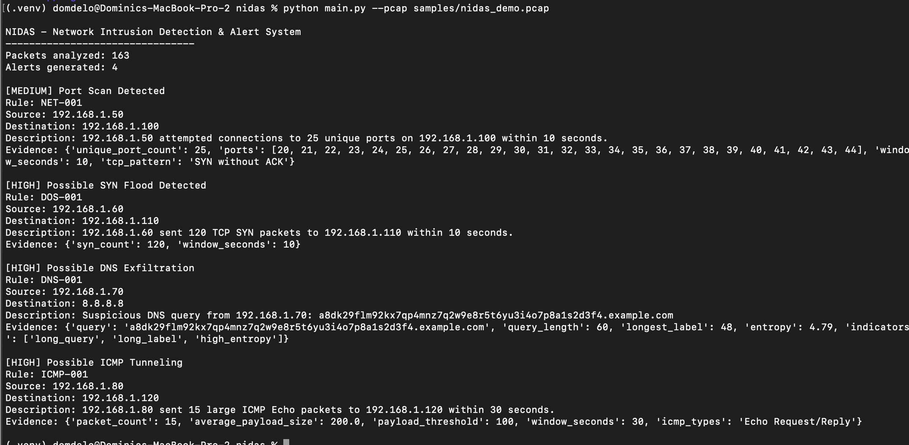
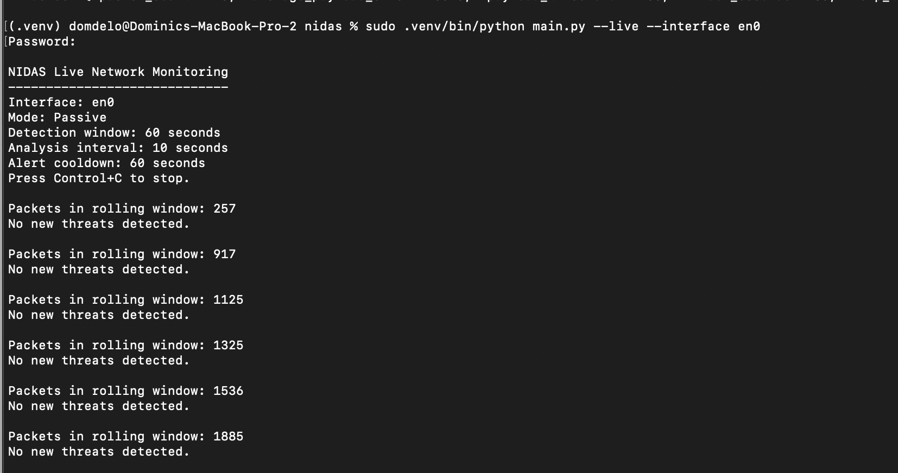

# NIDAS — Network Intrusion Detection & Alert System

NIDAS is a Python-based Network Intrusion Detection System (NIDS) designed to passively analyze network traffic and identify suspicious network behaviors.

The project supports both offline PCAP analysis and passive live network monitoring. It uses Scapy for packet processing, custom detection rules for threat identification, SQLite for alert persistence, and Streamlit for a SOC-style monitoring and analyst-triage dashboard.

NIDAS was built as a cybersecurity portfolio project to demonstrate practical experience with network security monitoring, detection engineering, packet analysis, alert correlation, MITRE ATT&CK mapping, testing, and security operations workflows.

---

## Features

- Passive network packet monitoring with Scapy
- Offline PCAP analysis
- Real-time rolling traffic analysis
- Four custom network detection rules
- Time-window and threshold-based correlation
- Alert cooldown and deduplication
- Bounded packet and alert-history state
- SQLite alert persistence
- Unique alert identifiers
- SOC-style Streamlit dashboard
- Analyst alert triage workflow
- Alert filtering and investigation
- MITRE ATT&CK mappings
- Automated detection and regression testing
- Graceful live-monitor shutdown and error handling

---

## Detection Rules

| Rule ID | Detection | Severity | MITRE ATT&CK | Tactic |
|---|---|---|---|---|
| `NET-001` | Port Scan | Medium | T1046 — Network Service Discovery | Discovery |
| `DOS-001` | SYN Flood | High | T1498 — Network Denial of Service | Impact |
| `DNS-001` | DNS Exfiltration | Medium / High | T1048 — Exfiltration Over Alternative Protocol | Exfiltration |
| `ICMP-001` | ICMP Tunneling | High | T1095 — Non-Application Layer Protocol | Command and Control |

### NET-001 — Port Scan Detection

Detects a source attempting TCP SYN connections to many unique destination ports on the same destination host within a short period.

Default detection threshold:

- 20 unique destination ports
- 10-second detection window
- TCP SYN packets without ACK

Established TCP traffic and SYN-ACK responses are excluded from the heuristic.

### DOS-001 — SYN Flood Detection

Detects a large number of TCP SYN packets sent from one source to a destination within a short time window.

Default detection threshold:

- 100 SYN packets
- 10-second detection window
- SYN packets without ACK

SYN-ACK responses and established TCP traffic are excluded.

### DNS-001 — Possible DNS Exfiltration

Analyzes DNS activity for characteristics associated with possible data exfiltration.

NIDAS evaluates indicators including:

- Long DNS queries
- Long DNS labels
- High query entropy
- High DNS query frequency
- High first-label variation

The frequency heuristic requires both elevated query volume and substantial variation in the first DNS label. This prevents repeated ordinary queries to the same hostname from triggering solely because of volume.

### ICMP-001 — Possible ICMP Tunneling

Detects repeated large ICMP Echo Request or Echo Reply packets between hosts.

Default detection threshold:

- Payload size of at least 100 bytes
- 10 qualifying packets
- 30-second detection window
- ICMP Echo Request or Echo Reply traffic

Other ICMP message types, such as destination-unreachable messages, are excluded from this tunneling heuristic.

---

## Architecture

```text
                    Network Traffic
                          |
                          v
                 +------------------+
                 |      Scapy       |
                 | Packet Capture / |
                 |   PCAP Reader    |
                 +--------+---------+
                          |
                          v
                 +------------------+
                 |  Packet Parser   |
                 | NetworkPacket    |
                 +--------+---------+
                          |
                          v
              +-----------------------+
              |   Detection Engine    |
              +-----------+-----------+
                          |
          +---------------+---------------+
          |               |               |
          v               v               v
     Port Scan        SYN Flood      DNS Analysis
      NET-001          DOS-001         DNS-001
                                          |
                                          |
                                          v
                                   ICMP Analysis
                                     ICMP-001
                          |
                          v
                 +------------------+
                 | Security Alerts  |
                 +--------+---------+
                          |
                          v
                 +------------------+
                 |      SQLite      |
                 | Alert Persistence|
                 +--------+---------+
                          |
                          v
                 +------------------+
                 |    Streamlit     |
                 |  SOC Dashboard   |
                 +------------------+
```

---

## Detection Pipeline

NIDAS converts captured traffic into a simplified internal `NetworkPacket` representation containing fields such as:

- Timestamp
- Source and destination IP
- Protocol
- Source and destination port
- TCP flags
- DNS query
- ICMP type and code
- ICMP payload size

The central detection engine passes the packet collection through each detection rule and returns alerts ordered by timestamp.

In live mode, NIDAS maintains a rolling packet window rather than retaining captured traffic indefinitely.

The current live-monitor configuration uses:

```text
Detection Window: 60 seconds
Analysis Interval: 10 seconds
Alert Cooldown:    60 seconds
```

Alert fingerprints are also pruned after their cooldown expires, keeping the live-monitor state bounded during longer sessions.

---

## Alert Model

Each detection generates a structured security alert containing information such as:

```text
Alert ID
Timestamp
Rule ID
Rule Name
Severity
Source IP
Destination IP
Protocol
Description
Detection Evidence
MITRE ATT&CK Tactic
MITRE ATT&CK Technique
MITRE ATT&CK Technique ID
```

Each alert occurrence receives a unique UUID while the stable rule ID identifies which detection generated the alert.

This allows multiple occurrences of the same detection to be stored without treating separate incidents as the same database record.

---

## SOC Dashboard

NIDAS includes a Streamlit dashboard for reviewing and triaging stored security alerts.

Dashboard functionality includes:

- Optional 5-second live refresh
- Total alert metrics
- High-severity alert count
- Open alert count
- Unique source count
- Severity analytics
- Detection-rule analytics
- Analyst workflow metrics
- Security alert table
- Detailed alert investigation
- Detection evidence inspection

### Dashboard Filters

Alerts can be filtered by:

- Severity
- Analyst status
- Detection rule
- Source IP
- Alert source

Alert sources distinguish between:

```text
PCAP
Live
Unknown
```

`Unknown` supports alerts created before source tracking was introduced.

### Analyst Workflow

Analysts can assign one of three statuses:

```text
New
Investigating
Resolved
```

Status changes are persisted in SQLite and remain available after dashboard refreshes or application restarts.

---

## Project Structure

```text
nidas/
├── app/
│   └── dashboard.py
│
├── capture/
│   ├── __init__.py
│   ├── parser.py
│   └── sniffer.py
│
├── data/
│   └── nidas.db
│
├── detection/
│   ├── __init__.py
│   ├── engine.py
│   ├── port_scan.py
│   ├── syn_flood.py
│   ├── dns_exfil.py
│   ├── icmp_tunnel.py
│   └── live_monitor.py
│
├── models/
│   ├── __init__.py
│   ├── packet.py
│   └── alert.py
│
├── samples/
│   ├── generate_demo.py
│   ├── nidas_demo.pcap
│   └── test_traffic.pcap
│
├── storage/
│   ├── __init__.py
│   └── alert_store.py
│
├── tests/
│   ├── __init__.py
│   ├── test_alert.py
│   ├── test_alert_store.py
│   ├── test_detection_engine.py
│   ├── test_detection_validation.py
│   ├── test_dns_exfil.py
│   ├── test_icmp_tunnel.py
│   ├── test_live_monitor.py
│   ├── test_parser.py
│   ├── test_pcap.py
│   ├── test_port_scan.py
│   └── test_syn_flood.py
│
├── .gitignore
├── main.py
├── README.md
└── requirements.txt
```

The SQLite database is generated locally and excluded from version control.

---

## Installation

### 1. Clone the Repository

```bash
git clone <your-repository-url>
cd nidas
```

### 2. Create a Virtual Environment

macOS/Linux:

```bash
python3 -m venv .venv
source .venv/bin/activate
```

Windows:

```powershell
python -m venv .venv
.venv\Scripts\activate
```

### 3. Install Dependencies

```bash
pip install -r requirements.txt
```

Core technologies include:

- Python
- Scapy
- Streamlit
- Pandas
- SQLite
- Pytest

---

## Usage

### Analyze a PCAP

Run NIDAS against a stored packet capture:

```bash
python main.py --pcap samples/nidas_demo.pcap
```

The included controlled demo currently produces:

```text
Packets analyzed: 163
Alerts generated: 4
```

The demo contains traffic constructed to exercise all four NIDAS detection rules.

---

## Passive Live Monitoring

Live monitoring requires a network interface.

Example on macOS:

```bash
sudo .venv/bin/python main.py --live --interface en0
```

The interface name depends on the operating system and host configuration.

NIDAS starts in passive monitoring mode and periodically analyzes the rolling packet window.

Example:

```text
NIDAS Live Network Monitoring
-----------------------------
Interface: en0
Mode: Passive
Detection window: 60 seconds
Analysis interval: 10 seconds
Alert cooldown: 60 seconds
Press Control+C to stop.
```

Stop monitoring with:

```text
Control+C
```

NIDAS shuts down the asynchronous packet sniffer before exiting.

> Live packet capture may require administrator/root privileges depending on the operating system.

---

## Launch the Dashboard

Start the Streamlit dashboard from the project root:

```bash
streamlit run app/dashboard.py
```

Streamlit will provide a local address for the dashboard.

Alerts generated through PCAP analysis or live monitoring are stored in SQLite and displayed by the dashboard.

---

## Testing

Run the complete automated test suite:

```bash
pytest -v
```

Current validated result:

```text
52 passed
```

The test suite covers areas including:

- Packet parsing
- PCAP processing
- Port-scan detection
- SYN-flood detection
- DNS-exfiltration detection
- ICMP-tunneling detection
- Detection-engine integration
- Alert generation
- UUID uniqueness
- SQLite persistence
- Analyst status updates
- Live packet-window trimming
- Alert cooldown behavior
- Alert-history pruning
- Detection thresholds
- Detection time windows
- Benign traffic cases
- Cross-rule isolation
- False-positive regression cases

---

## Detection Validation

NIDAS includes controlled detection-validation tests designed to verify both malicious-pattern detection and benign boundary behavior.

Examples include:

- Established TCP traffic does not trigger the port-scan rule
- SYN-ACK traffic does not trigger the SYN-flood rule
- Established TCP traffic does not trigger the SYN-flood rule
- Repeated normal DNS queries do not trigger the DNS-exfiltration rule
- Non-Echo ICMP error messages do not trigger the ICMP-tunneling rule
- Activity below configured thresholds does not generate alerts
- Activity outside configured time windows does not generate alerts

These tests validate the implemented heuristics under controlled conditions. They should not be interpreted as a measurement of real-world detection accuracy or false-positive rate.

---

## Controlled Demo Validation

The included demo PCAP contains:

```text
2   normal packets
25  port-scan packets
120 SYN-flood packets
1   suspicious DNS query
15  large ICMP packets
-------------------------
163 packets total
```

Running the central detection engine against the controlled PCAP generates:

```text
4 expected alerts
```

One alert is produced for each implemented detection scenario.

---

## MITRE ATT&CK Alignment

NIDAS maps its detection rules to behaviors represented in MITRE ATT&CK.

| Rule | Technique ID | Technique | Tactic |
|---|---|---|---|
| Port Scan | T1046 | Network Service Discovery | Discovery |
| SYN Flood | T1498 | Network Denial of Service | Impact |
| DNS Exfiltration | T1048 | Exfiltration Over Alternative Protocol | Exfiltration |
| ICMP Tunneling | T1095 | Non-Application Layer Protocol | Command and Control |

ATT&CK mappings provide context for the behavior detected by each rule. An alert indicates that traffic matched a NIDAS heuristic; it does not by itself prove that a specific adversary technique occurred.

---

## Security and Ethical Use

NIDAS is intended for:

- Cybersecurity education
- Defensive security research
- Authorized lab environments
- Analysis of packet captures you are permitted to inspect
- Passive monitoring of networks where you have authorization

Live monitoring in NIDAS is passive. The application does not need to generate scans, floods, tunneling traffic, or other attack traffic to operate.

Use controlled PCAP files, synthetic packet data, localhost environments, or isolated lab networks when validating attack-detection scenarios.

Do not capture or analyze network traffic without appropriate authorization.

---

## Limitations

NIDAS is an educational detection-engineering project and is not intended to replace an enterprise IDS/IPS or SIEM platform.

Current limitations include:

- IPv4-focused packet parsing
- Rule-based detection rather than behavioral or ML-based detection
- Fixed default thresholds
- No distributed sensor architecture
- No automatic response or packet blocking
- No threat-intelligence enrichment
- No encrypted-traffic inspection
- Local SQLite storage
- Detection results depend on the traffic visible to the capture interface

The DNS and ICMP detections identify suspicious patterns rather than proving that exfiltration or command-and-control activity occurred.

---

## Future Improvements

Potential future extensions include:

- Configurable detection thresholds
- External configuration files
- IPv6 support
- Detection-rule enable/disable controls
- Additional network detection rules
- Alert export
- Threat-intelligence enrichment
- PCAP upload through the dashboard
- Historical alert trending
- Structured logging
- Docker deployment
- CI/CD test automation

---

## Screenshots

Add screenshots of the finished project here.

Suggested screenshots:

### SOC Dashboard

```text
docs/images/dashboard-overview.png
```

### Alert Investigation

Analysts can investigate individual alerts, review detection evidence and MITRE ATT&CK context, and update the alert's investigation status.



### PCAP Analysis

The controlled 163-packet demonstration PCAP generates four expected alerts across the implemented detection rules.



### Passive Live Monitoring

NIDAS passively monitors a selected network interface using a rolling detection window.



---

## Technologies

**Language:** Python

**Packet Analysis:** Scapy

**Dashboard:** Streamlit

**Data Processing:** Pandas

**Persistence:** SQLite

**Testing:** Pytest

**Security Framework:** MITRE ATT&CK

---

## Project Status

NIDAS currently supports:

- [x] Packet parsing
- [x] PCAP analysis
- [x] Passive live capture
- [x] Port-scan detection
- [x] SYN-flood detection
- [x] DNS-exfiltration heuristics
- [x] ICMP-tunneling heuristics
- [x] Central detection engine
- [x] Rolling live correlation
- [x] Alert cooldown and deduplication
- [x] Bounded live-monitor state
- [x] SQLite alert persistence
- [x] SOC dashboard
- [x] Analyst triage
- [x] MITRE ATT&CK mapping
- [x] Automated testing
- [x] Controlled detection validation

---

## Dom Deloatch

Built as a cybersecurity portfolio project demonstrating network security monitoring, detection engineering, packet analysis, security automation, and SOC analyst workflows.
